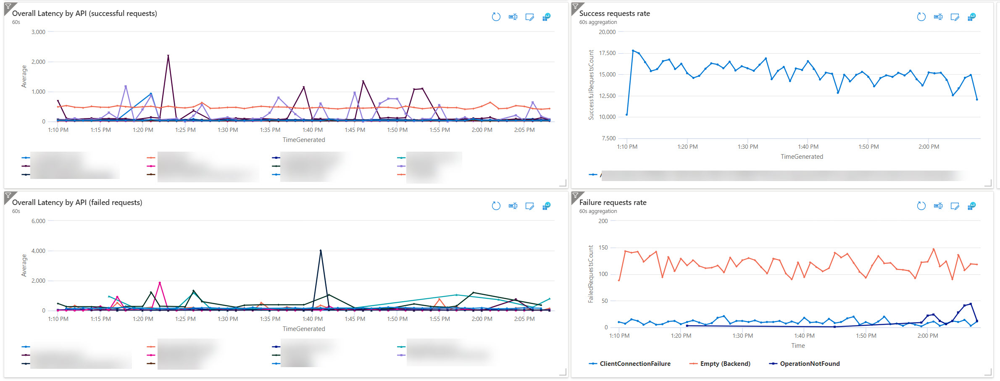

# Golden metrics (Traffic, Latency, Errors, Saturation)

## Latency example
Example for Latency 
* split views successful / failed 

## Errors example

Errors thrown by the APIM gateway
* ((ResponseCode > 499 or ResponseCode == 0) and BackendResponseCode <> ResponseCode) 
* (BackendResponseCode == 200 and ResponseCode == 200 and IsRequestSuccess == false)

[] are failed OPTIONS calls with ResponseCode == 0

Drill down into ClientConnectionFailures

## Saturation

The Capacity metric is the most used to understand how "full" is our instances.

Another view on the capacity is available on the "Diagnose and solve problems" section : Capacity by role

